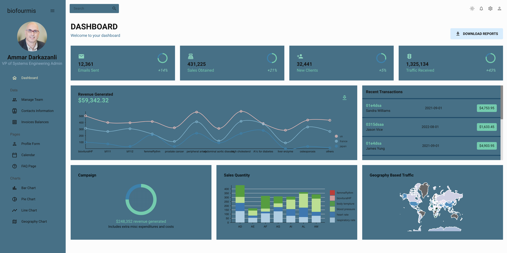

# Biofourmis-AG Dashboard Project

 

## Highlights

React Admin Dashboard for a Biofourmis.com - A company who I believe in its mission by Transforming patient health through personalized, predictive care.
This Dashbord consist:

- Light/Dark Mode
- 3 Data Tables Pages
- FAQ Page - Form Page
- Calendar Integration
- 4 Charts Graphs

### Skills

#### My projects includes, but not limited to:

###### More information coming soon!

 

Website: https://biofourmis.netlify.app/
 
Author: TierraBCodes
